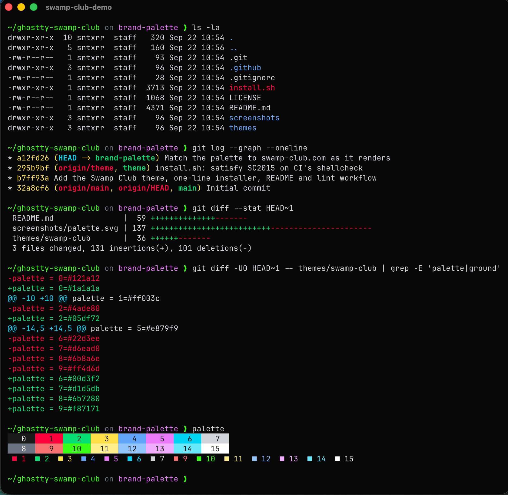
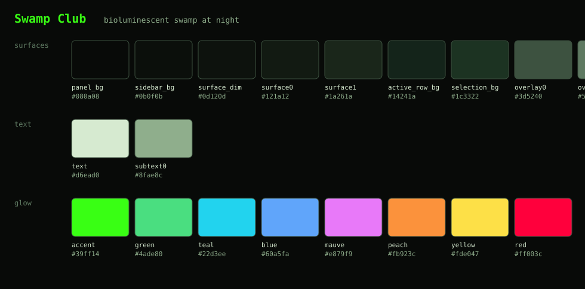

# Swamp Club — a theme for [Ghostty](https://ghostty.org)

Bioluminescent swamp at night: pitch-black water, a neon-green cursor and
bright-green, and magenta and cyan will-o'-the-wisps for the rest of the
palette.



It pairs with a sidebar theme for the [herdr](https://herdr.dev) workspace
manager so the panes and the chrome around them share one palette:
[herdr-swamp-club](https://github.com/sntxrr/herdr-swamp-club).

## Install

### One line

```sh
curl -fsSL https://raw.githubusercontent.com/sntxrr/ghostty-swamp-club/main/install.sh | bash
```

That writes the theme to `~/.config/ghostty/themes/swamp-club`, backs up
your Ghostty config next to itself, and sets `theme = swamp-club` (replacing
an existing `theme =` line if you had one). Then reload Ghostty:
**`⌘⇧,`** on macOS, **`Ctrl+Shift+,`** elsewhere.

Add `--dry-run` to see what it would touch, or `--theme-only` to install the
file and leave your config alone.

### By hand

1. Save [`themes/swamp-club`](themes/swamp-club) to `~/.config/ghostty/themes/swamp-club`:

   ```sh
   mkdir -p ~/.config/ghostty/themes
   curl -fsSL https://raw.githubusercontent.com/sntxrr/ghostty-swamp-club/main/themes/swamp-club \
        -o ~/.config/ghostty/themes/swamp-club
   ```

   This is the only directory Ghostty searches for user themes — on macOS
   too, even if your config lives in `~/Library/Application Support/com.mitchellh.ghostty/`.

2. Add one line to your Ghostty config:

   ```
   theme = swamp-club
   ```

3. Reload: `⌘⇧,` on macOS, `Ctrl+Shift+,` elsewhere.

### Light and dark

Ghostty can pick a theme per system appearance. Swamp Club is dark-only, so
pair it with something light:

```
theme = light:Catppuccin Latte,dark:swamp-club
```

## Uninstall

Remove the `theme = swamp-club` line (or restore the backup the installer
wrote), delete `~/.config/ghostty/themes/swamp-club`, and reload.

## Palette



| slot | normal | bright |
|---|---|---|
| black | `#121a12` | `#6b8a6e` |
| red | `#ff003c` | `#ff4d6d` |
| green | `#4ade80` | **`#39ff14`** |
| yellow | `#fde047` | `#fef08a` |
| blue | `#60a5fa` | `#93c5fd` |
| magenta | `#e879f9` | `#f0abfc` |
| cyan | `#22d3ee` | `#67e8f9` |
| white | `#d6ead0` | `#f0f7ec` |

| | |
|---|---|
| background | `#080a08` |
| foreground | `#d6ead0` |
| cursor | `#39ff14` on `#080a08` |
| selection | `#d6ead0` on `#1c3322` |
| split divider | `#3d5240` |

Bright green is the neon on purpose: it's what `ls`, git and most prompts
reach for to mark success and highlights, so the glow shows up in everyday
output while the normal green stays readable in bulk.

## Tweaks

A theme file is just a Ghostty config file, and anything you set in your own
config wins over the theme. The knob people ask about first:

- **Comments too dim / too loud?** Bright black (`palette = 8=…`) is what most
  tools use for dim text. Override it in your config:

  ```
  palette = 8=#7f9c82
  ```

## Notes

- Tested on Ghostty 1.3. Any 1.x release with the `theme` option should work.
- The palette is borrowed, with affection, from [swamp.club](https://swamp.club).
  This project is not affiliated with Swamp Club, Inc.
- MIT licensed.
